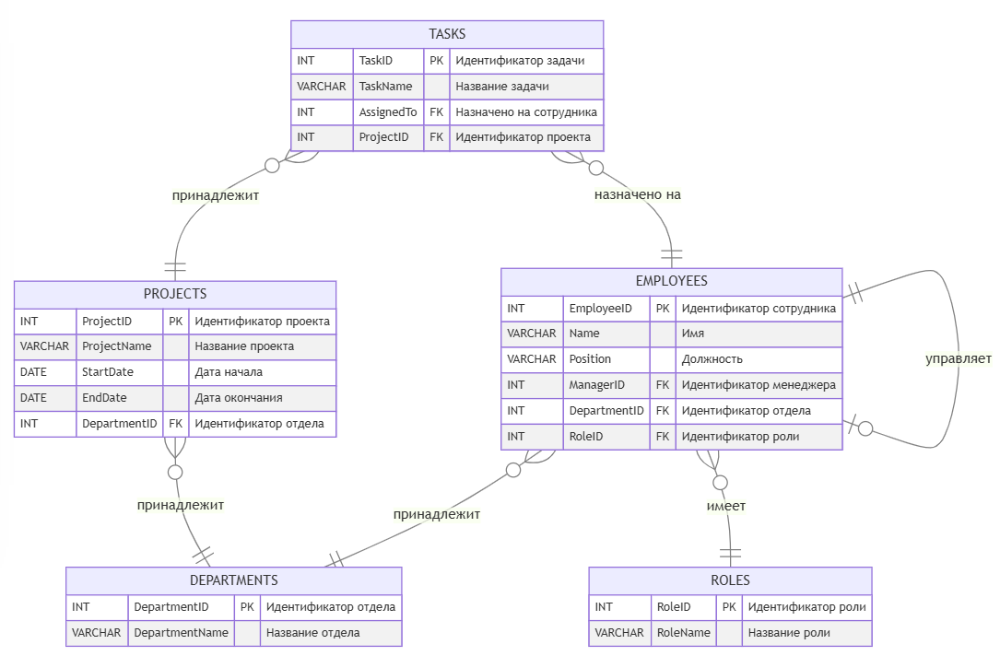

# Домашнее задание по дисциплине "Базы данных"


## 1. Описание проекта

В рамках выполнения задания требовалось решить несколько групп задач на языке SQL. Для каждой предметной области были предоставлены готовые скрипты создания таблиц и наполнения их тестовыми данными.  
Основной акцент сделан на разработке SQL-запросов для анализа данных и решения прикладных задач.

### Цель:
 - Освоить написание сложных SQL-запросов для анализа данных, включая работу с агрегатами, подзапросами и рекурсивными структурами.
### Задачи: 
 - Написание SQL-запросов для анализа данных в различных предметных областях
 - Использование различных типов джойнов 
 - Применение агрегатных функций
 - Группировка и фильтрация данных
 - Агрегация строковых значений
 - Работа с подзапросами и CTE
    
## 2. Структура проекта

```
/database-finalwork
│
├── База данных 1. Транспортные средства/
│   ├── init.sql        # создание таблиц (Classes, Cars, Races, Results) и наполнение их данными
│   ├── solutions.sql   # решение задач
│
├── База данных 2. Автомобильные гонки/
│   ├── init.sql        
│   ├── solutions.sql
│
├── База данных 3. Бронирование отелей/
│   ├── init.sql        
│   ├── solutions.sql
│
├── База данных 4. Структура организации/
│   ├── init.sql        
│   ├── solutions.sql
│
└── README.md
```

### Схемы баз данных
<details>
<summary>Транспортные средства - Vehicle</summary>


</details>

<details>
<summary>Автомобильные гонки - Races</summary>


</details>

<details>
<summary>Бронирование отелей - Booking</summary>


</details>

<details>
<summary>Структура компании - Company</summary>



</details>

Для просмотра схемы базы данных нажмите на спойлер


## Инструкция по запуску

1. Установите PostgreSQL. Скачать: https://www.postgresql.org/download/
2. Создайте базу данных, например:
   ```sql
   CREATE DATABASE mephi_db_practice;
   ```
3. Подключитесь к созданной базе и поочерёдно выполните скрипты создания и наполнения таблиц (`init.sql`). Порядок не важен, так как таблицы независимы.
4. Запустите файлы с решениями (`solutions.sql`) для проверки результатов

## Тестирование
Полученный результат сравнить с эталонным, выполнив запрос в среде psql или в любом GUI (pgAdmin, DBeaver).

